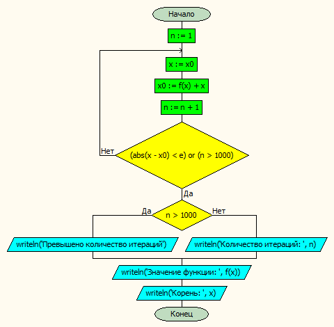
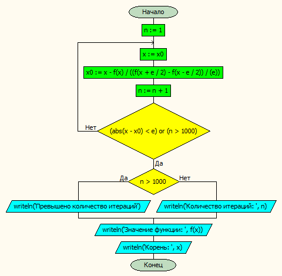
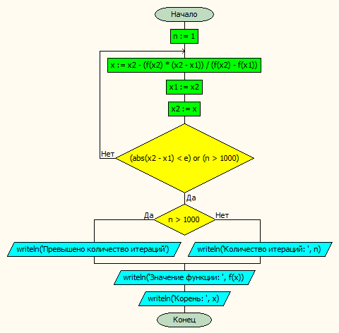

# Лабораторная работа № 2

#### Постановка задачи.
Разработать программу для приближённого нахождения корня уравнения f(x) = 0.
Корень уравнения находится тремя методами – методом секущих, методом простых итераций и методом Ньютона. Функция, для которой ищется корень, передаётся в процедуру, реализующую метод нахождения корня, с помощью функционального типа.
Корень уравнения определяется с заданной точностью ε. Для каждого метода нужно также найти количество итераций, необходимых для вычисления корня. Осуществлять выход из цикла, когда количество итераций становится слишком большим.
В качестве результата нужно вывести значение корня, значение функции в корне и количество итераций или сообщение о том, что превышено максимально допустимое количество итераций.
Методы поиска корня уравенения реализовать в отдельном модуле.
#### Таблица данных

| Класс | Имя | Смысл | Тип | Структура |
| ---- | --- | ----- | --- | --------- |
| Входные данные | e | точность | вещ. | прост. перем. |
| Входные данные | a,b | концы отрезка | вещ. | прост. перем. |
| Выходные данные | xs,xi,xn | корни уравнения | вещ. | прост. перем. |
| Выходные данные | ns,ni,nn | кличество итераций | цел. | прост. перем. |
| Промежуточные данные | tmp | начальное приближение | вещ. | прост. перем. |

#### Входная форма
*В режиме диалога*
Введите левый и правый конец отрезка:
a,b
Введите точность
e
#### Выходная форма
Неверно заданы концы отрезка
Неверно введена точность
**Для функции <номер функции>:**
Решение методом секущих:

	Количество итераций:
	Значение функции:
	Корень:
Решение методом простых итераций:

	Количество итераций:
	Значение функции:
	Корень:
Решение методом Ньютона:

	Количество итераций:
	Значение функции:
	Корень:

#### Аномалии
- Неверно заданы границы отрезка, на котором должен осуществляться поиск корня уравнения.
- Неверно задана точность вычислений.
#### Тестовые примеры
**Входные данные**
a = 0.1
b = 2.1
e = 0.00001
**Ожидаемые результаты**
Для функции 1:
Решение методом секущих:
Количество итераций: 1
Значение функции: -1.24193988426669E-11
Корень: 1.50039730569801
Решение методом простых итераций:
Количество итераций: 2
Значение функции: -2.61951151658835E-07
Корень: 1.50039749305181
Решение методом Ньютона:
Количество итераций: 2
Значение функции: 1.0428189467504E-07
Корень: 1.50039723110066

Для функции 2:
Решение методом секущих:
Количество итераций: 1
Значение функции: 1.58228985469577E-12
Корень: 1.35041151862629
Решение методом простых итераций:
Количество итераций: 2
Значение функции: -4.66767149376324E-08
Корень: 1.35041154927602
Решение методом Ньютона:
Количество итераций: 2
Значение функции: 2.44100508695055E-08
Корень: 1.3504115025993


#### Метод
Вводим концы отрезка и проверяем аномалию, вводим точность
Вычисляем значения функции тремя способами, реализованными в модуле
Вычисления проводятся до достижения необходимой точности или покане превышено заданное количество итераций
#### Алгоритм
**Метод простых итераций**

**Метод Ньютона**

**Метод секущих**


#### Программа
###### Основаная программа
```pascal
program lab2;

uses computing;
var 	e,xs,xi,xn: real;
	a,b,tmp: real;
	ni,ns,nn: integer;
begin

	writeln('Введите левый и правый конец отрезка');
	readln(a,b);
	if (a>b) or (a>1) or (b<1.7) or (a<0) or (b>2.7) then
		writeln('Неверно заданы концы отрезка')
	else begin
		writeln('Введите точность');
		readln(e);
		if (e<=0) or (e>1) then writeln('Неверно введена точность')
		else begin
			writeln('Для функции 1:');
			writeln('Решение методом секущих: ');
			secMethod( a,b, xs, e, myfunc1, ns);
			writeln('Решение методом простых итераций: ');
			tmp := (a+b)/2;
			iterMethod( tmp, xi,e,myfunc1, ni );
			writeln('Решение методом Ньютона: ');
			newtonMethod( tmp, xn,e,myfunc1, nn );
			writeln('==================================');
			writeln('Для функции 2:');
			writeln('Решение методом секущих: ');
			secMethod( a,b, xs, e, myfunc2, ns);
			writeln('Решение методом простых итераций: ');
			tmp := (a+b)/2;
			iterMethod( tmp, xi,e,myfunc2, ni );
			writeln('Решение методом Ньютона: ');
			newtonMethod( tmp, xn,e,myfunc2, nn );
		end;
	end;
end.
```
###### Модуль с функциями вычисления корней
```pascal
unit computing;


interface
type
	func = function(const x:real):real;


function myfunc1(const x:real):real;

function myfunc2(const x:real):real;

procedure secMethod(var x1,x2,x:real; const e: real; f:func; var n:integer);

procedure iterMethod(var x0,x:real; const e: real; f:func; var n:integer);

procedure newtonMethod( var x0,x:real; const e:real; f:func; var n:integer );

implementation
{=================================================================================}
{=================================================================================}

function myfunc1(const x:real):real;
begin
	result := sqrt( 1.96 - (power(x,3)/9) + 1/x ) - x;
end;


{=================================================================================}
{=================================================================================}

function myfunc2(const x:real):real;
begin
	result := (power(4,1/3) - power(sin(x/10),2))/(sqrt(x)) -x;
end;

{=================================================================================}
{=================================================================================}
procedure secMethod(var x1,x2,x:real; const e: real; f:func; var n:integer);
begin
	n := 1;
	repeat
		x := x2 - ( f(x2)*(x2-x1) )/( f(x2)-f(x1) );
		x1 := x2;
		x2 := x;
	until (abs(x2-x1)<e) or (n > 1000);
	if n>1000 then writeln('Превышено количество итераций')
	else writeln('Количество итераций: ',n);
	writeln('Значение функции: ', f(x));
	writeln('Корень: ',x);
end;

{=================================================================================}
{=================================================================================}
procedure iterMethod(var x0,x:real; const e: real; f:func; var n:integer);
begin
	n := 1;
	repeat
		x := x0;
		x0 := f(x) + x;
		n := n + 1;
	until (abs(x-x0)<e) or (n > 1000);
	if n>1000 then writeln('Превышено количество итераций')
	else writeln('Количество итераций: ',n);
	writeln('Значение функции: ', f(x));
	writeln('Корень: ',x);
end;
{=================================================================================}
{=================================================================================}
procedure newtonMethod( var x0,x:real; const e:real; f:func; var n:integer );
begin
	n := 1;
	repeat
		x := x0;
		x0 := x - f(x)/( ( f(x+e/2) - f(x-e/2) ) / ( e ) );
		n := n + 1;
	until (abs(x-x0)<e) or (n > 1000);
	if n>1000 then writeln('Превышено количество итераций')
	else writeln('Количество итераций: ',n);
	writeln('Значение функции: ', f(x));
	writeln('Корень: ',x);
end;


initialization
finalization
end.
```
