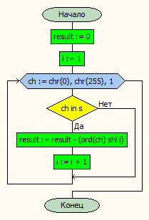
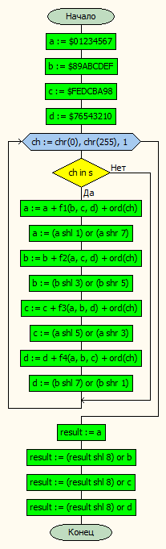
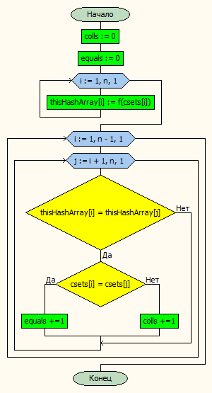

# Лабораторная работа № 3

#### Постановка задачи.
Проверить наличие совпадающих множеств в наборе множеств с использованием хеширования – подсчитать количество равенств и количество коллизий. Использовать три различные хеш-функции. Подобрать набор множеств для тестирования

#### Таблица данных

| **Класс**             | **Имя**                     | **Смысл**               | **Тип**            | **Структура**   |
|-----------------------|-----------------------------|-------------------------|--------------------|-----------------|
| Входные данные        | csets                       | массив множеств         | множество символов | массив          |
| Промежуточныен данные | n                           | количество множеств     | цел\.              | прост\.перем\.  |
|                       | fin,fout                    | фходной и выходной файл | текст\. файл       | файл            |
|                       | errorIndexMsg, errorFileMsg | сообщения об ошибке     | строка             | прост\.перем\.  |
| Выходные данные       | colls                       | кол\-во коллизий        | цел\.              | прост\. перем\. |
|                       | equals                      | кол\-во равенств        | цел\.              | прост\. перем\. |


#### Входная форма
\< Множество 1 >
\< Множество 2 >
................
\< Множество n >
#### Выходная форма
Number of sets =
colls =
equals =
#### Аномалии
- Недостаточно параметров.
- Невозможно открыть файл для чтения.
#### Тестовые примеры
**Входные данные**
Набор с сайта
**Результат**
Number of sets = 50000
==================================================
*Hash1 function*:
colls = 124527
equals = 2590
==================================================
*Hash2 function*:
colls = 0
equals = 2590
==================================================
*Hash3 function*:
colls = 26923
equals = 2590

#### Метод
Для каждого множества вычисляем значение хеш-функции. Затем каждое множество сравниваем с последующими – сначала сравниваем значения хеш-функции для данной пары множеств, в случае равенства значений хеш-функции сравниваем сами множества.
#### Алгоритм
**Хеш-функция 1**

**Хеш-функция 3**

**Поиск равенств и коллизий**


#### Программа
```pascal
program lab3;
uses mysetarray;


var
	csets: SetsArray;
	n, equals, colls: integer;
	fin,fout: textfile;
	errorIndexMsg, errorFileMsg: string;

begin

	errorIndexMsg := 'Недостаточно параметров или выход за предел описания массива';
	errorFileMsg := 'Невозможно открыть файл для чтения';
	try
		assignfile(fin,ParamStr(1));
		reset(fin);
		assignfile(fout, ParamStr(2));
		rewrite(fout);
		readMySetArray(csets,n,fin);
		writeln(fout, 'Number of sets = ',n);
		writeln(fout,'==================================================');
		writeln(fout);
		colls := 0;
	  equals := 0;
		findCollsEquals(csets,n,colls,equals,Hash1);
		writeln('Hash1 function:');
		writeln(fout,'colls = ', colls );
		writeln(fout,'equals = ', equals);
		writeln(fout,'==================================================');
		writeln(fout);
		colls := 0;
	  equals := 0;
		findCollsEquals(csets,n,colls,equals,Hash2);
		writeln('Hash2 function:');
		writeln(fout,'colls = ', colls );
		writeln(fout,'equals = ', equals);
		writeln(fout,'==================================================');
		writeln(fout);
		colls := 0;
	  equals := 0;
		findCollsEquals(csets,n,colls,equals,Hash3);
		writeln('Hash3 function:');
		writeln(fout,'colls = ', colls );
		writeln(fout,'equals = ', equals);

		closefile(fin);
		closefile(fout);
	except
		on System.IndexOutOfRangeException do writeln(errorIndexMsg);
		on System.IO.FileNotFoundException do writeln(errorFileMsg);

	end;

end.


```
#### Модуль ввода и вычисления
```pascal
unit mysetarray;


interface

type
	myset = set of char;
	SetsArray = array[1..100000] of myset;
	hashArray = array[1..100000] of integer;
	func = function(s:myset):integer;

procedure readMySetArray(var x:SetsArray;var n: integer; f:textfile);
procedure writeMySetArray(var x:SetsArray;const n: integer; f:textfile);

function Hash1(s:myset):integer;
function Hash2(s:myset):integer;
function Hash3(s:myset):integer;


procedure findCollsEquals (const csets: SetsArray;const n: integer; var colls,equals: integer; f:func );

implementation
{===========================================================}
{===========================================================}
function f1( var x,y,z: byte ):byte ;
begin
	result := (x and y) or (not x and z);
end;
{===========================================================}
{===========================================================}
function f2( var x,y,z: byte ):byte ;
begin
	result := (x and z) or (not z and y);
end;
{===========================================================}
{===========================================================}
function f3( var x,y,z: byte ):byte ;
begin
	result := x xor y xor z;
end;
{===========================================================}
{===========================================================}
function f4( var x,y,z: byte ):byte ;
begin
	result := y xor (not z or x);
end;
{===========================================================}
{===========================================================}
procedure readMySetArray(var x:SetsArray;var n: integer; f:textfile);
var 	ch:char;
	i: integer;
begin
	i := 1;
	while not eof(f) do begin
		while not eoln(f) do begin
			read(f,ch);
			include(x[i],ch);
		end;
		readln(f);
		i += 1;
	end;
	n := i - 1;

end;

{===========================================================}
{===========================================================}
procedure writeMySetArray(var x:SetsArray;const n: integer; f:textfile);
var 	ch:char;
	i: integer;
begin
	for i := 1 to n do begin
		for ch:= chr(0) to chr(255) do begin
			if ch in x[i] then write(f,ch);
		end;
		writeln(f);
	end;
end;
{===========================================================}
{===========================================================}
function Hash1(s:myset):integer; // set of char
var
	ch:char;
	i:integer;
begin
	result := 0;//empty;
	i := 1;
	for ch:= chr(0) to chr(255) do begin
    if ch in s then begin
		  result := result - (ord(ch) shl i);
		  i := i + 1;
		  end;
	end;
end;
{===========================================================}
{===========================================================}
function Hash2(s:myset):integer; // set of char
var
	ch:char;
	one:integer;

begin
	one := 1;
	result := 0; //empty;
	foreach ch in s do
		result := result or (one shl (ord(ch)-ord('A')));
end;
{===========================================================}
{===========================================================}
function Hash3(s:myset):integer;
var
	a,b,c,d:byte;
	ch: char;
begin
	a := $01234567;
	b := $89ABCDEF;
	c := $FEDCBA98;
	d := $76543210;
	for ch:= chr(0) to chr(255) do begin
    if ch in s then begin
      a := a + f1(b,c,d) + ord(ch);
  		a := (a shl 1) or (a shr 7);
  		b := b + f2(a,c,d) + ord(ch);
  		b := (b shl 3) or (b shr 5);
  		c := c + f3(a,b,d) + ord(ch);
  		c := (a shl 5) or (a shr 3);
  		d := d + f4(a,b,c) + ord(ch);
  		d := (b shl 7) or (b shr 1);
    end;
  end;
	result := a;
	result := (result shl 8) or b;
	result := (result shl 8) or c;
	result := (result shl 8) or d;
end;
{===========================================================}
{===========================================================}
procedure findCollsEquals( const csets: SetsArray;const n: integer; var colls,equals: integer; f:func );
var 	runPercent : real;
      thisHashArray: hashArray;

begin
	colls := 0;
	equals := 0;
	for i:integer := 1 to n do thisHashArray[i] := f(csets[i]);
	for i:integer := 1 to n-1 do begin
    runPercent := (100 / n)*i;
    writeln('Running: ', runPercent:6:3,'%');
		for j:integer := i+1 to n do begin
			if thisHashArray[i] = thisHashArray[j] then begin
				if csets[i] = csets[j] then equals += 1
				else colls += 1;
			end;
		end;
	end;

end;
{===========================================================}
{===========================================================}


initialization

finalization
end.

```
