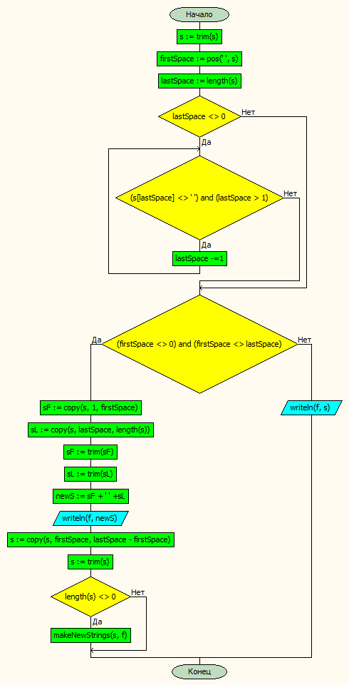

# Лабораторная работа № 4

#### Постановка задачи.
Сформировать строку, «склеив» первое слово с последним, второе с предпоследним и т.д. 

#### Таблица данных
| **Класс**            | **Имя**               | **Смысл**                           | **Тип**        | **Структура**   |
|----------------------|-----------------------|-------------------------------------|----------------|-----------------|
| Входные данные       | s                     | обрабатываемая строка               | строковый      | прост\. перем   |
| Промежуточные данные | fin, fout             | входной и выходной файл             | текстовый файл | файл            |
| Промежуточные данные | firstSpace, lastSpace | индекс первого и последнего пробела | цел\.          | прост\. перем\. |
| Промежуточные данные | sF,sL                 | первое и последнее слово в строке   | строковый      | прост\. перем\. |
| Выходные данные      | newS                  | склееные слова                      | строковый      | прост\. перем\. |

#### Входная форма
Строка 1
Строка 2
...
Строка n 
#### Выходная форма
Для каждой строки: 
- Строка 1 
- Склеенные первое и последнее слово
- Склеенные второе и предпоследнее слово и тд
#### Аномалии
- Недостаточно параметров.
- Невозможно открыть файл для чтения.
#### Тестовые примеры
**Входные данные**
hello my    dear friend
how  are you
i will write 2 more words
**Результат**
hello my    dear friend
hello friend
my dear
################
how  are you
how you
are
###############
i will write 2 more words
i words
will more
write 2

#### Метод
В итерационном цикле считываем строку, удаляем пробелы в начале и конце, ищем позицию первого и последнего пробела, копируем подстроку от первого до последнего пробела и выполняем эту ооперацию рекурсивно, пока не останется строки без пробелов или номер первого пробела будет равен номеру последнего. 
#### Алгоритм

