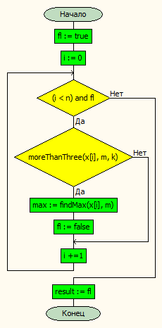
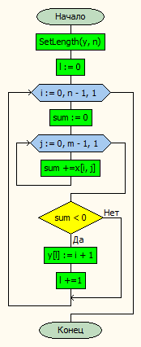
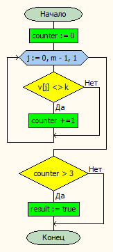

# Лабораторная работа № 5

#### Постановка задачи.
Найти максимальный элемент первой строки матрицы, содержащей более трёх элементов, неравных заданному числу. Если такой строки нет, сформировать новый массив – найти номера строк матрицы, сумма элементов которых меньше 0. 

#### Таблица данных
| **Класс**            | **Имя**   | **Смысл**               | **Тип**        | **Структура**                   |
|----------------------|-----------|-------------------------|----------------|---------------------------------|
| Входные данные       | a         | матрица                 | вещ\.          | массив массивов\(динамических\) |
| Входные данные       | an, am    | размер матрицы          | цел\.          | прост\. перем\.                 |
| Входные данные       | k         | данное число            | вещ\.          | прост\. перем\.                 |
| Промежуточные данные |  l        | размер массива          | цел\.          | прост\. перем\.                 |
| Промежуточные данные | fin, fout | входной и выходной файл | текстовый файл | файл                            |
| Выходные данные      | max       | максимум                | вещ\.          | прост\. перем\.                 |
| Выходные данные      | b         | одномерный массив       | вещ\.          | динамический массив             |

#### Входная форма
Заданное число \
Размеры матрицы \
Матрица 
#### Выходная форма
Матрица \
Rows indexes: \
Max =  
#### Аномалии
- Недостаточно параметров.
- Невозможно открыть файл для чтения.
#### Тестовые примеры
**Входные данные** \
2 \
3 4 \
2 2 2 2 \
2 2 5 -12 \
2 2 2 -97 \
**Результат** \
2 2 2 2  \
2 2 5 -12  \
2 2 2 -97  \
Rows indexes: \
     2,      3 

#### Метод
Вводим массив, выводим его, в цикле с досрочным выходом итерируемся по строкам, ищем первую, в которой существует больше трех элементов(считаем через доп. счетчик), неравных заданному числу. Если строка найдена, то ищем в ней максимум, иначе итерируясь по строкам матрицы ищем те, у которых сумма элементов меньше нуля и добавляем номер соотвествующей строки в массив, создав отдельный счетчик элементов массива
#### Алгоритм
**findFirstMax** \
 \
**makeNewArray** \
 \
**moreThanThree** \

