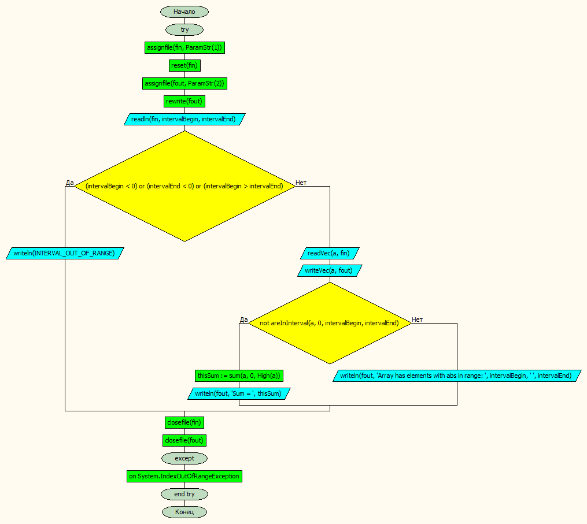
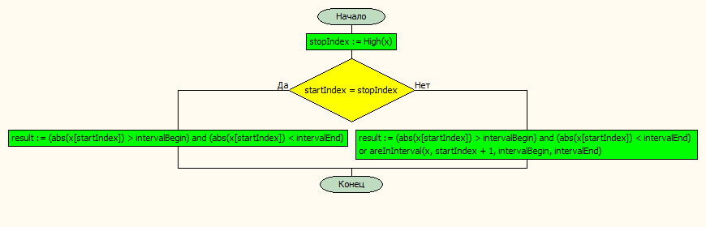
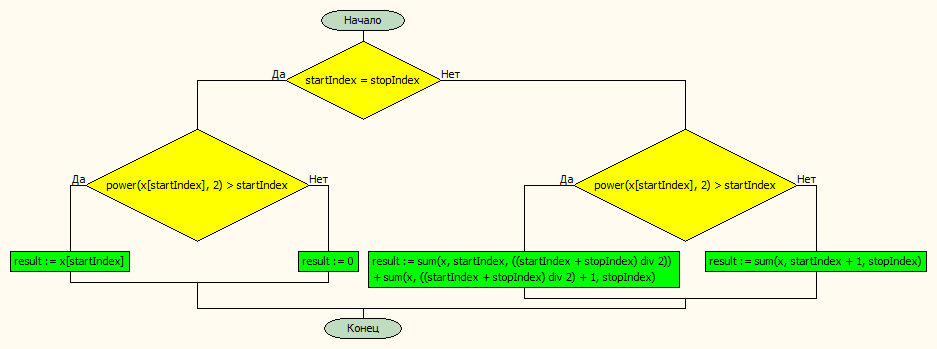

# Лабораторная работа № 6

#### Постановка задачи.
Если в одномерном массиве a из n элементов нет элементов, модуль которого попадает в заданный диапазон, найти сумму элементов массива, для которых выполняется условие a[i] ^ 2 > i. 

#### Таблица данных
| **Класс**            | **Имя**                    | **Смысл**                | **Тип**        | **Структура**                   |
|----------------------|----------------------------|--------------------------|----------------|---------------------------------|
| Входные данные       | a                          | матрица                  | вещ\.          | массив массивов\(динамических\) |
| Входные данные       | k                          | данное число             | вещ\.          | прост\. перем\.                 |
| Входные данные       |  n                         | размер массива           | цел\.          | прост\. перем\.                 |
| Входные данные       | intervalBegin, intervalEnd | начало и конец диапазона | вещ\.          | прост\. перем\.                 |
| Промежуточные данные | fin, fout                  | входной и выходной файл  | текстовый файл | файл                            |
| Выходные данные      | thisSum                    | сумма                    | вещ\.          | прост\. перем\.                 |

#### Входная форма
Границы диапазона \
Размер массива \
Массив 
#### Выходная форма
Массив \
Sum =  
#### Аномалии
- Недостаточно параметров
- Невозможно открыть файл
- Границы диапазона заданы неверно
#### Тестовые примеры
**Входные данные** \
2 8 \
15 \
13 -25 9 -35 1 76 -83 358 42 71 28 -64 34 14 78 \
**Результаты** \
13  -25  9  -35  1  76  -83  358  42  71  28  -64  34  14  78   \
Sum = 516

#### Метод
Вводим интервал, в который должны попадать элементы массива и проверяем их на положительность. 
Если диапазон задан неверно выводим сообщение, иначе водим массив. 
Если в массиве нет элементов, подуль которых попадает в интервал, то ищем сумму, иначе  выводим сообщение о том, что в массиве есть нужные элементы.
#### Алгоритм
 \
**areInInterval** \
 \
**sum** \

