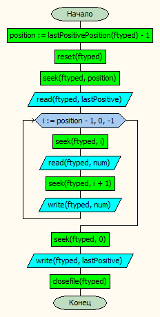
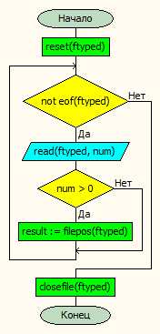

# Лабораторная работа № 7

### Постановка задачи.
 Разработать программу для работы с типизированным файлом. Программа должна сделать следующее:
- создать типизированный файл из текстового файла;
- вывести содержимое типизированного файла;
- найти значение элемента, удовлетворяющего заданному условию, и его позицию в типизированном файле;
- переставить элемент, удовлетворяющий заданному условию, в указанную позицию (в файле должны сохраниться все исходные значения);
- вывести содержимое изменённого типизированного файла. 

### Таблица данных
| **Класс**            | **Имя**                    | **Смысл**                         | **Тип**        | **Структура**       |
|----------------------|----------------------------|-----------------------------------|----------------|---------------------|
| Входные данные       | k                          | данное число                      | вещ\.          | прост\. перем\.     |
| Входные данные       |  n                         | размер массива                    | цел\.          | прост\. перем\.     |
| Входные данные       | intervalBegin, intervalEnd | начало и конец диапазона          | вещ\.          | прост\. перем\.     |
| Промежуточные данные | fin, fout                  | входной и выходной файл           | текстовый файл | файл                |
| Выходные данные      | realFile                   | файл с числами                    | вещ\.          | типизированный файл |
| Промежуточные данные | ftyped                     | файл с числами                    | вещ\.          | типизированный файл |
| Промежуточные данные | num                        | обрабатываемое число              | вещ\.          | прост\. перем\.     |
| Промежуточные данные | position                   | позиция последнего положительного | цел\.          | прост\. перем\.     |
| Промежуточные данные | lastPositive               | последний положительный элемент   | вещ\.          | прост\. перем\.     |

### Входная форма
Вещественные числа через пробел(оканчивается файл последним числом, то есть не должно быть пробелов или пустых строк в конце файла)
### Выходная форма
Исходные данные с переставленным числом
### Аномалии
- Недостаточно параметров
- Невозможно открыть файл
- Границы диапазона заданы неверно
- Неправильно создан входной файл
### Тестовые примеры
#### Тест 2
**Входные данные** \
3 -1 6 -1 -2 9 -3 -1 \
**Результаты** \
3.00 -1.00 6.00 -1.00 -2.00 9.00 -3.00 -1.00 \
9.00 3.00 -1.00 6.00 -1.00 -2.00 -3.00 -1.00 
#### Тест 2
**Входные данные** \
10 -10 67 -14 -27 92 -33 -16 \
**Результаты** \
В файле нет чисел в диапазоне от -9.9 до 9.9 или положительных чисел
#### Тест 3
**Входные данные** \
-34 -12 -6 1 -2 -9 -3 -1 \
**Результаты** \
-6.00 1.00 -2.00 -9.00 -3.00 -1.00  \
1.00 -6.00 -2.00 -9.00 -3.00 -1.00
### Метод
Преобразуем текстовый файл в типизированный, выводим содержимое типизированного в выходной текстовый, находим последний положительный элемент, сдвигаем все элементы до него на одну позицию назад(по очереди перезаписывая) и записываем последний положительный в начало файла
### Алгоритм
**insertLastPositive** \
 \
**lastPositivePosition** \

